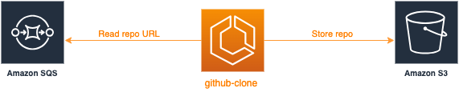

# github-clone

This microservice is listening to a AWS SQS queue waiting for messages. When it receives a message, it gets from its payload the GitHub repository URL, then it clones the repository and save it on a AWS S3 bucket.



- The payload of a message retrieved from the AWS SQS queue are shown below:
```json
{
    "repo_url": "https://github.com/user/public-repo-name.git"
}
```

- See [./src/env](./src/env.py) to see the required environment variables.
